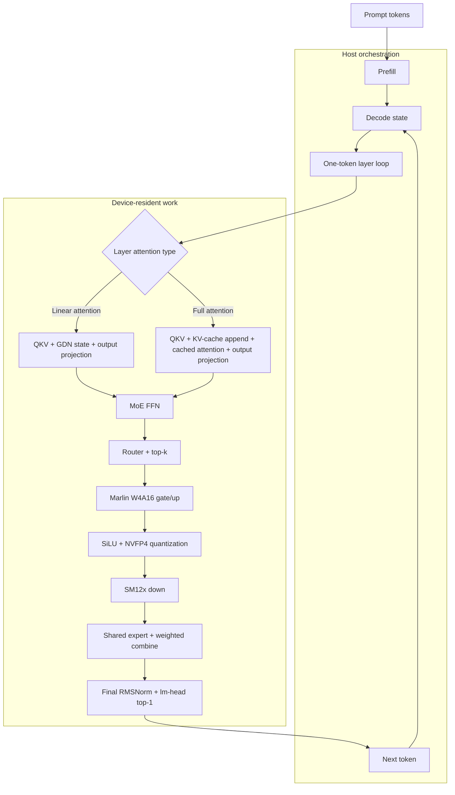

# Eider

> ... the eider duck: a small northern creature with an unreasonable amount of
insulation (ahem)

'tis my small Rust-first inference-engine laboratory for NVIDIA DGX
Spark (GB10, Grace Blackwell) running NVFP4 models. (Specifically
really just Qwen3.6 MoE models for now).

This started as a way to learn some of the hardware bit on my own
Spark -- which I've had for months without really taking full
advantage of -- but without putting a pile of tensor frameworks and
abstraction between me and the interesting bits.

This machine is materially different from a datacentre GPU: it is an aarch64
host with 128 GiB of coherent unified memory and shared LPDDR5x bandwidth.
Those constraints make memory traffic, launch overhead, and the host/device
boundary important parts of the design. Decode tends to become a bandwidth
problem before it becomes a compute problem, which is why the project spends so
much time on representations, small kernels, and measuring the whole path.

Anyways, this is a bit of research project, not a production engine,
and I'm pretty new to this stuff, so be easy on me if you happen to
look at it.

That said, it is currently pretty competitive -- getting ~65 token/sec
on Qwen 3.6 30b A3B, compared to vLLM's ~70 -- while seemingly using
quite a bit less memory and having a faster startup time. (Likely
because I'm missing a bunch of stuff.)

And so I will likely continue to iterate on improving both performance
and runtime surface (likely adding a more robust KVCache and OpenAI
API frontend.) 

I think a thing like this could become useful for people who want an
easy-packaged and fast simple deployment for Qwen 3.6 on the Spark,
for example.

It's also an attempt to have a bit of a nicely self-contained Rust
crate with some NVFP4 / GB10 specific kernels and bits that maybe
others can re-use in their own projects once it grows up.

### A note about authorship

The opening shape of this project was substantially written by me
because the point was to understand the hardware rather than treat it
as a black box. As the work moved into FFI boilerplate, format
conversions, CUDA wrappers, and benchmark harnesses, AI assistance
became a larger part of the implementation. Once I got into heavy
performance tuning, things started to get really agent driven.

Anyways, that boundary is deliberately mentioned rather than hidden
and I do not yet claim to understand every detail of every kernel;
part of the next phase of work here is turning those pieces back into
things I can explain and trust better.

## Workspace

The workspace has two layers:

- `crates/nvfp4` owns device buffers, ModelOpt NVFP4/FP8 loading, cuBLASLt
  plans, CUDA FFI, custom kernels, and low-level micromeasures. Its source is
  grouped into `cublaslt/`, `kernels/`, and `diagnostics/` by topic.
- `crates/infer` owns model loading, Qwen layer execution, KV-cache state,
  request-scoped sampling and generation, prefill/decode orchestration, CLI
  binaries, and runtime benchmarks. Its reusable execution state lives under
  `runtime/`, while model-family code lives under `qwen3/`.

CUDA kernels live in `crates/nvfp4/native/` and are linked into the Rust
crate by its build script. CUTLASS is optional; when it is unavailable, the
build uses the cuBLASLt or stub fallback where supported.

## Models

The current model targets are:

- `models/qwen3-8b-nvfp4`
- `models/qwen3-30b-a3b-nvfp4`
- `models/qwen3-32b-nvfp4`
- `models/qwen3.6-35b-a3b-nvfp4`

Models are expected to be ModelOpt-quantized NVFP4 checkpoints with the
repository's expected manifest and tokenizer files.

The first Qwen3.6 startup builds the SM12x down-weight cache under
`.eider-cache/sm12x-down-v1/` inside the model directory. This is a one-time,
down-only repack of roughly 5 GiB for the 35B-A3B checkpoint. Cache files are
written atomically and incomplete layers are resumed on the next startup;
later runs validate and reuse the completed cache automatically.

## Runtime shape

The steady-state Qwen3.6 path is a device-resident decode loop. Rust owns the
layer orchestration and state transitions; CUDA, cuBLASLt, Marlin, and SM12x
implement the measured kernels underneath it.



CUDA graph replay captures the stable decode segments where possible; the
KV-cache and attention state remain device-resident across iterations.

## Build and run

Requirements are Rust, CUDA 13.x, cuBLASLt, and an `nvcc` capable of compiling
`sm_121` code. Build and test with:

```sh
cargo build -p infer
cargo build --release -p infer
cargo test --workspace
cargo clippy --workspace --all-targets -- -D warnings
```

Qwen3.6 smoke test:

```sh
cargo run --release -p infer --bin qwen36-generate -- \
    models/qwen3.6-35b-a3-nvfp4 "What is 2+2?" 30
```

The generator applies the checkpoint's text chat prefix and reads its sampling
defaults from `generation_config.json` (`temperature`, `top_k`, `top_p`, and
EOS token IDs). Positional overrides follow the token count in this order:
temperature, top-k, top-p, seed, presence penalty, and frequency penalty. Pass
`0` as the temperature to use the faster deterministic GPU top-1 path:

```sh
cargo run --release -p infer --bin qwen36-generate -- \
    models/qwen3.6-35b-a3-nvfp4 "What is 2+2?" 30 0
```

Throughput benchmark:

```sh
cargo run --release -p infer --bin qwen-bench -- \
    --model models/qwen3.6-35b-a3-nvfp4 \
    --prompt "Hello world, this is a benchmark." \
    --decode-tokens 200 \
    --warmup-repeats 1 \
    --repeats 3 \
    --temperature 0
```

Use `--profile-decode` for stage timings. It synchronizes between stage groups,
so its throughput is diagnostic and is not directly comparable with the normal
CUDA-graph benchmark.

For decode correctness isolation, set `EIDER_DISABLE_DECODE_GRAPHS=1` to run
the same model path without segmented CUDA graph replay. This is a diagnostic
comparison, not the fast default.

## CUTLASS setup

CUTLASS is needed when using the dense Qwen GEMV backend or running the
CUTLASS-specific low-level tests and benchmarks. 

You do not need CUTLASS for the normal Qwen3.6 path. Its Marlin gate/up and
SM12x down kernels build and run without a CUTLASS checkout.

If you need it though, the build looks for it under `.deps/cutlass`
and uses `.deps/cutlass-build-sm121` by default. Configure it
explicitly with:

```sh
scripts/setup-cutlass-sm12x.sh
source .deps/cutlass-sm12x.env
```

The compile probe is available as:

```sh
scripts/probe-cutlass-sm12x.sh
```

## Microbenchmarks

Benchmarks use my [`micromeasure`](https://github.com/rdaum/micromeasure) crate.

Useful current targets include:

```sh
cargo bench -p nvfp4 --bench marlin_routed_gate_up
cargo bench -p infer --bench qwen36_routed_gate_up
cargo bench -p nvfp4 --bench lm_head_top1
cargo bench -p nvfp4 --bench sm12x_indexed_gemv
cargo bench -p nvfp4 --bench fp4_cublaslt
cargo bench -p nvfp4 --bench fp4_quantization
cargo bench -p infer --bench sampling
```

Keep kernel claims tied to a shape-appropriate micromeasure and an end-to-end
decode run. An isolated faster kernel is not evidence of a faster model.

## Comparison helpers

For an already-running OpenAI-compatible vLLM server:

```sh
VLLM_URL=http://127.0.0.1:8000/v1/completions \
EIDER_MODEL_DIR=models/qwen3.6-35b-a3-nvfp4 \
scripts/compare-vllm.sh
```

`scripts/bench-eider-vllm-docker.sh` starts the configured vLLM Docker image
and runs the same comparison. The scripts accept environment overrides for the
model, prompt, token count, repeat count, and endpoint.

The remaining deep-dive kernel reference lives in `docs/cutlass-sm12x-nvfp4.md`.
