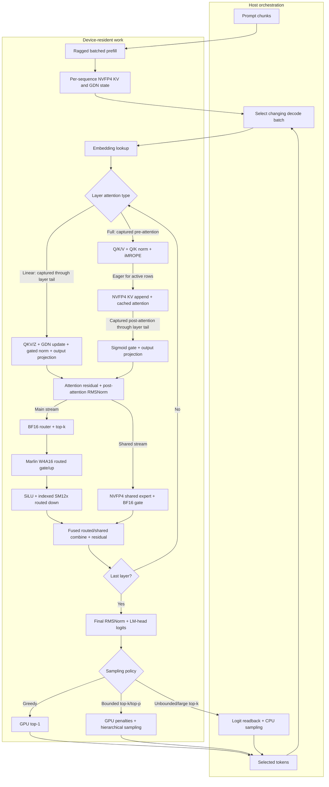

# Eider

> ... the eider duck: a small northern creature with an unreasonable amount of
> insulation (ahem)

This is an inference and serving runtime for NVIDIA DGX Spark (GB10, Grace
Blackwell) running Qwen3.6, the Qwen3.5-MoE fine-tune Agents-A1, StepFun's
Step-3.7-Flash, Gemma 4 26B-A4B, and NVIDIA's Nemotron 3 Puzzle hybrid model.
It includes an OpenAI API-compatible server with continuous multi-session
scheduling and a compact FP4 KV cache for the Qwen, Step, and Gemma attention
paths. Nemotron combines backbone attention with Mamba recurrent state.

This started as a personal research project and is crawling towards more of a
production engine -- most parts of the kernel layer are agent-written; see the
authorship note below. It also contains a self-contained Rust crate with NVFP4 /
GB10 specific kernels that others may potentially reuse in their projects.

### Why... ?

The Spark is not a datacentre GPU (despite the marketing.) The SM12x Blackwell
in it is not the same as the heavy duty "grown up" version. So I have a personal
suspicion that it will likely be better served in the medium term by a bespoke
runtime than by work being done on the vLLM mainline.

But mainly, I wanted to learn more about how an inference runtime is structured, and
I wanted to understand more about the Spark's architecture, and I got annoyed by
how heavy weight vLLM is, and I got frustrated by the state (or lack of it) of
NVFP4 in `llama.cpp`.

### Performance

Representative single-session results on one GB10 are below. Decode rates are
through the OpenAI-compatible API; a dash means that a comparable vLLM
throughput run has not been completed.

| Model | Eider decode tok/s | vLLM decode tok/s | Configuration |
| --- | ---: | ---: | --- |
| [Qwen3.6-35B-A3B](https://huggingface.co/nvidia/Qwen3.6-35B-A3B-NVFP4) | 72.7 | 77.0 | NVFP4 weights; compact FP4 KV in Eider, BF16 KV in vLLM |
| [Agents-A1](https://internscience.github.io/Agents-A1/) | 63.6 | 37.2 | Eider FP8-converted attention and LM head; checkpoint-native vLLM |
| [Step-3.7-Flash](https://huggingface.co/stepfun-ai/Step-3.7-Flash-NVFP4) | 20.4 | — | 240 of 288 routed experts resident per layer |
| [Gemma 4 26B-A4B](https://huggingface.co/nvidia/Gemma-4-26B-A4B-NVFP4) | 30.1 | 29.6 | Same ModelOpt NVFP4 weights; compact FP4 KV in Eider, FP8 E4M3 KV in vLLM |
| [Nemotron Labs 3 Puzzle 75B-A9B](https://huggingface.co/nvidia/NVIDIA-Nemotron-Labs-3-Puzzle-75B-A9B-NVFP4) | — | — | Throughput comparison pending |

Gemma prefills a fresh roughly 2,700-token Pi/API prompt at about 6,740 prompt
tokens/sec, compared with about 7,060 in vLLM. Prefix reuse brought a typical
follow-up to 235 ms TTFT. An Agents-A1 Pi session sustained 58-60 decode
tokens/sec through 4,200-token turns and 44.5 at 17,748 tokens.

Step-3.7 is a 198B checkpoint served with disk-backed expert paging. Converting
its remaining BF16 weights to NVFP4 reduces resident device weights from 95.5
to 87.3 GiB. Puzzle occupies 41.9 GiB of Eider device weights.

The largest differences from vLLM are operational: Eider starts substantially
faster and has a smaller idle footprint because sequence state is allocated on
demand rather than as a large up-front KV pool. It also supports a compact
NVFP4 KV cache directly on SM121. The local vLLM Puzzle control used FP8 E4M3
KV rather than NVFP4.

Both advantages leave more of the Spark's 128 GB unified memory available for
longer contexts and concurrent requests. In particular, the smaller NVFP4 KV
cache leaves more room for model weights and could raise the practical
model-size ceiling relative to a runtime using BF16 KV. Finding the largest
useful checkpoint that fits on one Spark is a planned next test.

### A note about authorship

The opening shape of this project was substantially written by hand
because the point was to understand the hardware rather than treat it
as a black box. As the work moved into FFI boilerplate, format
conversions, CUDA wrappers, and benchmark harnesses, AI assistance
became a larger part of the implementation, and the performance tuning
is heavily agent driven.

That boundary is deliberate and visible rather than hidden. Not every
detail of every kernel is something I can yet explain from scratch, and
turning those pieces back into things I can explain and trust better is
part of the ongoing work here.

## Workspace

The workspace has three crates:

- `crates/nvfp4` owns device buffers, ModelOpt NVFP4/FP8 loading, cuBLASLt
  plans, CUDA FFI, custom kernels, and low-level micromeasures. Its source is
  grouped into `cublaslt/`, `kernels/`, and `diagnostics/` by topic.
- `crates/infer` owns model loading, model execution, KV-cache state,
  request-scoped sampling and generation, Qwen3.6, Step-3.7, Gemma 4, and Nemotron 3
  scheduling, prefill/decode orchestration, CLI binaries, and runtime
  benchmarks. Its reusable execution state lives under `runtime/`.
- `crates/eider-api` owns the dedicated inference actor and OpenAI-compatible
  HTTP/SSE adapter used by agent clients. CUDA state remains on the actor's OS
  thread while async handlers submit, stream, and cancel requests over bounded
  channels. It also exposes Prometheus and optional DogStatsD metrics for HTTP
  requests, scheduler activity, token usage, throughput, and SM12x cache
preparation.

CUDA kernels live in `crates/nvfp4/native/` and are linked into the Rust
crate by its build script. CUTLASS is optional; when it is unavailable, the
build uses the cuBLASLt or stub fallback where supported.

## Models

Checkpoints kept under `models/`:

- `models/qwen3-30b-a3b-nvfp4`
- `models/qwen3.6-35b-a3b-nvfp4`
- `models/qwen3.6-35b-a3b-nvfp4-unsloth-fast`
- `models/qwen3.6-35b-a3b-nvfp4-unsloth`
- `models/agents-a1-nvfp4`
- `models/step-3.7-flash-nvfp4`
- `models/gemma-4-26b-a4b-nvfp4`
- `models/nemotron-3-super-120b-a12b-nvfp4`

Models are expected to use the repository's supported ModelOpt or
compressed-tensors NVFP4/FP8 layouts and include the expected manifest and
tokenizer files. The Unsloth Fast checkpoint keeps its MoE experts in NVFP4;
the accuracy-oriented Unsloth checkpoint uses channel-scaled FP8 experts and
shared experts in layers 32-39. The dense Qwen3 checkpoints (`qwen3-8b`,
`qwen3-32b`) are still supported by the loader and the dense GEMV/CUTLASS
path but are not kept on this machine.

Agents-A1 uses the same Qwen3.5-MoE runtime as Qwen3.6. Its checkpoint has BF16
attention projections and a BF16 LM head alongside its NVFP4 experts; Eider can
retain those types or convert the BF16 weights to FP8 or NVFP4. The checkpoint
also contains a vision tower, but Eider currently serves its text path only.

[Gemma 4 26B-A4B](https://huggingface.co/nvidia/Gemma-4-26B-A4B-NVFP4)
uses native NVFP4 experts alongside BF16 attention, routing, and dense MLP
weights. Eider serves its heterogeneous local/global attention with a compact
FP4 KV cache and the checkpoint's thinking and tool-call protocol.

[NVIDIA Nemotron Labs 3 Puzzle 75B-A9B](https://huggingface.co/nvidia/NVIDIA-Nemotron-Labs-3-Puzzle-75B-A9B-NVFP4)
uses an 88-layer Mamba-2, sparse latent-MoE, and grouped-query attention
backbone with layer-specific expert widths and top-k routing. Eider loads those
checkpoint settings directly and retains 41.9 GiB including its MTP block.

The first Qwen3.6 startup builds the SM12x down-weight cache under
`.eider-cache/sm12x-down-v1/` inside the model directory. This is a one-time,
down-only repack of roughly 5 GiB for the 35B-A3B checkpoint. Mixed-precision
checkpoints build it only for layers whose down weights are NVFP4. Cache files
are written atomically and incomplete layers are resumed on the next startup;
later runs validate and reuse the completed cache automatically.

## Running the server

Start the Qwen3.6 server with:

```sh
scripts/run-eider-qwen-server.sh
```

Its native FP8 attention projections remain FP8 by default. Set
`EIDER_QWEN_FP8_ATTENTION=nvfp4` to enable the experimental runtime conversion.

Start Agents-A1 with:

```sh
scripts/run-eider-agents-a1-server.sh
```

Start Step-3.7 with:

```sh
scripts/run-eider-stepfun-server.sh
```

Start Gemma 4 with:

```sh
scripts/run-eider-gemma4-server.sh
```

Start Nemotron Labs 3 Puzzle with:

```sh
scripts/run-eider-nemotron3-puzzle-server.sh
```

The Nemotron launcher stores dense weights in NVFP4 and uses an FP32
backbone-attention cache by default. Set `EIDER_NEMOTRON_KV_CACHE=nvfp4` when
long-context headroom matters more than serving speed. It also uses the shared
prompt-prefix cache by default; set `--prefix-cache-gib 0` to disable it.

The StepFun launcher prepares or validates the disk-backed expert cache before
starting the server and defaults to 240 resident experts per routed layer. Set
`EIDER_STEP_EXPERT_CAPACITY` to change that tradeoff. Its BF16 attention,
dense MLP, shared-expert, and LM-head weights default to NVFP4; override them
independently with `EIDER_STEP_BF16_ATTENTION`, `EIDER_STEP_BF16_DENSE_MLP`,
`EIDER_STEP_BF16_SHARED_EXPERT`, and `EIDER_STEP_BF16_LM_HEAD`, each accepting
`bf16` or `nvfp4`. The Agents-A1 server
accepts the checkpoint's full 262,144-token context; override it with
`EIDER_MAX_CONTEXT_TOKENS`. Its BF16 attention projections and LM head default
to NVFP4; `EIDER_QWEN_BF16_ATTENTION` and `EIDER_QWEN_BF16_LM_HEAD` independently
accept `bf16`, `fp8`, or `nvfp4`. Its Pi entry advertises a 131,072-token working
window so compaction starts well before that hard limit. The launchers build
the release server, listen on `127.0.0.1:8080`, and default the API key to
`local-eider`.
Override their model, listen address, served name, or key with `EIDER_MODEL_DIR`,
`EIDER_LISTEN`, `EIDER_SERVED_MODEL`, and `EIDER_API_KEY`.
The server exposes Prometheus text at `/metrics` and health at `/healthz`; set
`EIDER_DOGSTATSD_ENDPOINT` (with optional `EIDER_DOGSTATSD_INTERVAL_SECS`) to
additionally push metrics over UDP. The `eider-serve` binary also takes
`--decode-capacity`, `--prefill-sequence-capacity`, `--prefill-token-capacity`,
`--max-active-sequences`, and `--max-context-tokens` flags that map directly to
the scheduler admission limits. All supported serving paths retain up to 2
GiB of device-resident prompt checkpoints by default; pass
`--prefix-cache-gib 0` to disable it or another whole-GiB value to change the
budget. Responses report reused input tokens as
`usage.input_tokens_details.cached_tokens`, and the checkpoint cache exports
hit, miss, eviction, retained-byte, and copy-latency metrics alongside the other
scheduler telemetry.

Run Pi against the matching server with:

```sh
scripts/run-pi-eider-qwen.sh
scripts/run-pi-eider-agents-a1.sh
scripts/run-pi-eider-stepfun.sh
scripts/run-pi-eider-gemma4.sh
scripts/run-pi-eider-nemotron3-super.sh
```

Arguments are forwarded to `pi`, so a non-interactive smoke request looks like:

```sh
scripts/run-pi-eider-stepfun.sh --print "Reply with one short greeting."
```

The Pi launcher uses `pi/agent/models.json` through `PI_CODING_AGENT_DIR`,
selects its native `openai-responses` provider, and does not modify the user's
global Pi configuration.

Point Codex at it with a custom provider in `~/.codex/config.toml`:

```toml
model = "eider-qwen3.6"
model_provider = "eider"

[model_providers.eider]
name = "Eider"
base_url = "http://127.0.0.1:8080/v1"
env_key = "EIDER_API_KEY"
wire_api = "responses"
```

The adapter accepts Codex message and function-call history, renders function
tools through the checkpoint chat template, streams Responses lifecycle and
function-argument events, and cancels scheduler work when a client disconnects.
Run the full local Codex integration test explicitly with:

```sh
QWEN36_MODEL=models/qwen3.6-35b-a3-nvfp4 \
cargo test --release -p eider-api --test codex -- --ignored --nocapture
```

## Build and run

Requirements are Rust, CUDA 13.x, cuBLASLt, and an `nvcc` capable of compiling
`sm_121` code. Build and test with:

```sh
cargo build -p infer
cargo build --release -p infer
cargo test --workspace
cargo clippy --workspace --all-targets -- -D warnings
```

### Smoke test and benchmarks

Qwen3.6 smoke test:

```sh
cargo run --release -p infer --bin qwen36-generate -- \
    models/qwen3.6-35b-a3-nvfp4 "What is 2+2?" 30
```

Nemotron Labs 3 Puzzle smoke test:

```sh
cargo run --release -p infer --bin nemotron3-generate -- \
    models/nemotron-labs-3-puzzle-75b-a9b-nvfp4 "What is 2+2?" 30 nvfp4 nvfp4
```

The generator applies the checkpoint's text chat prefix and reads its sampling
defaults from `generation_config.json` (`temperature`, `top_k`, `top_p`, and
EOS token IDs). Positional overrides follow the token count in this order:
temperature, top-k, top-p, seed, presence penalty, and frequency penalty. Pass
`0` as the temperature to use the faster deterministic GPU top-1 path:

```sh
cargo run --release -p infer --bin qwen36-generate -- \
    models/qwen3.6-35b-a3-nvfp4 "What is 2+2?" 30 0
```

Throughput benchmark:

```sh
cargo run --release -p infer --bin qwen-bench -- \
    --model models/qwen3.6-35b-a3-nvfp4 \
    --prompt "What is the meaning of life?" \
    --decode-tokens 512 \
    --warmup-repeats 1 \
    --repeats 3 \
    --temperature 0
```

On 2026-07-14 at revision `1f445ce`, that run used a seven-token prompt and
reported a median 6,602.8 ms for 512 decode tokens, or 77.54 tokens/sec.

Use `--profile-decode` for stage timings. It synchronizes between stage groups,
so its throughput is diagnostic and is not directly comparable with the normal
CUDA-graph benchmark.

For decode correctness isolation, set `EIDER_DISABLE_DECODE_GRAPHS=1` to run
the same model path without segmented CUDA graph replay. This is a diagnostic
comparison, not the fast default.

## Runtime shape

The steady-state Qwen3.6 path is a device-resident decode loop. Rust owns the
layer orchestration and state transitions; CUDA, cuBLASLt, Marlin, and SM12x
implement the measured kernels underneath it.



Sequence-owned KV and recurrent states remain device-resident as requests move
between decode batches. Linear-attention layers replay one captured layer
graph. Full-attention layers replay captured pre- and post-attention graphs
around the active-row KV-cache operation. The shared expert overlaps the routed
experts on a second CUDA stream. `EIDER_DISABLE_DECODE_GRAPHS=1` retains the
same execution path but submits its layer work eagerly.

## CUTLASS setup

CUTLASS is needed when using the dense Qwen GEMV backend or running the
CUTLASS-specific low-level tests and benchmarks.

You do not need CUTLASS for the normal Qwen3.6 path. Its Marlin gate/up and
SM12x down kernels build and run without a CUTLASS checkout.

If you need it though, the build looks for it under `.deps/cutlass`
and uses `.deps/cutlass-build-sm121` by default. Configure it
explicitly with:

```sh
scripts/setup-cutlass-sm12x.sh
source .deps/cutlass-sm12x.env
```

The compile probe is available as:

```sh
scripts/probe-cutlass-sm12x.sh
```

## Microbenchmarks

Benchmarks use my [`micromeasure`](https://github.com/rdaum/micromeasure) crate.

Useful current targets include:

```sh
cargo bench -p nvfp4 --bench marlin_routed_gate_up
cargo bench -p nvfp4 --bench marlin_shared_expert
cargo bench -p nvfp4 --bench lm_head_top1
cargo bench -p nvfp4 --bench sm12x_indexed_gemv
cargo bench -p nvfp4 --bench nvfp4_kv_attention
cargo bench -p nvfp4 --bench fp8_routed_moe
cargo bench -p nvfp4 --bench fp8_linear
cargo bench -p nvfp4 --bench fp4_cublaslt
cargo bench -p nvfp4 --bench fp4_quantization
cargo bench -p nvfp4 --bench moe_topk
cargo bench -p nvfp4 --bench gated_delta_net
cargo bench -p infer --bench qwen36_routed_gate_up
cargo bench -p infer --bench qwen36_decode_batch
cargo bench -p infer --bench qwen36_prefill
cargo bench -p infer --bench step37_prefill
cargo bench -p infer --bench qwen36_cpu_shared_expert
cargo bench -p infer --bench sampling
```

Keep kernel claims tied to a shape-appropriate micromeasure and an end-to-end
decode run. An isolated faster kernel is not evidence of a faster model.

## Comparison helpers

For an already-running OpenAI-compatible vLLM server:

```sh
VLLM_URL=http://127.0.0.1:8000/v1/completions \
EIDER_MODEL_DIR=models/qwen3.6-35b-a3-nvfp4 \
scripts/compare-vllm.sh
```

`scripts/bench-eider-vllm-docker.sh` starts the configured vLLM Docker image
and runs the same comparison. The scripts accept environment overrides for the
model, prompt, token count, repeat count, and endpoint.

Further implementation notes live in:

- `docs/qwen36-batch-decode-plan.md` for the batch contract, correctness
  evidence, and remaining scheduler-admission measurements.
- `docs/cutlass-sm12x-nvfp4.md` for the SM12x/CUTLASS kernel investigation.
